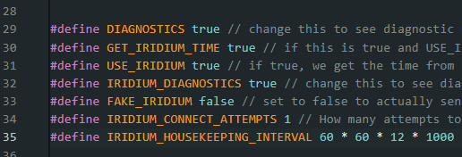

Firmware
========

Equipment
~~~~~~~~~~

* Toughbook with datalogger firmware
* Datalogger PCB 

Do this first somewhere with an internet connection, where you can troubleshoot. Then try with everything in airplane mode, to make sure it all works offline.

* Connect the datalogger to the toughbook via USB. Open up the datalogger code in Arduino IDE (should be the git branch danzhur2025_iridium_safe from https://github.com/mrpj100/Datalogger2023, unless told otherwise by CHIL!).
* Things to check in the datalogger code:
    #. Iridium settings (see figure :numref:`fig-iridium-settings-old`}). Remember to turn diagnostics on for testing, and off for deployment.
    #. wurst IDs: listed from line 41. There is also a wurst count: this should be the number of wursts in the list of IDs.
    #. timing between transmission: change SBD_SEND_DELAY on line 84 to the set the delay between sending satellite messages. This should be 3600s (1 hour) for deployment, but for testing something like 180s (3 minutes) is good. Any shorter risks confusing the poor modem.

* send sketch to the datalogger.
* If there is a satellite modem attached, check in the Arduino serial monitor to see if the Iridium connection is working. 
* Close Arduino IDE (otherwise VSCode will not connect to the datalogger)
* Open up https://github.com/mrpj100/cryowurst-packet-decoder in VSCode. Change any instance of a named COM port to the correct one (look in Device Manager to find which COM port the datalogger is connected to). Run the script.
* Serial output should display data from the logger, and any cryowurst data packets as they arrive.
    
.. _fig-iridium-settings-old:

   Relevant Iridium settings in Datalogger2023 for system testing. Diagnostics can be turned off for deployment. 

If the system is not working: 

    * Check which git branch you are using.
    * Check there is power to the PCB.
    * Check the modem is wired in correctly.